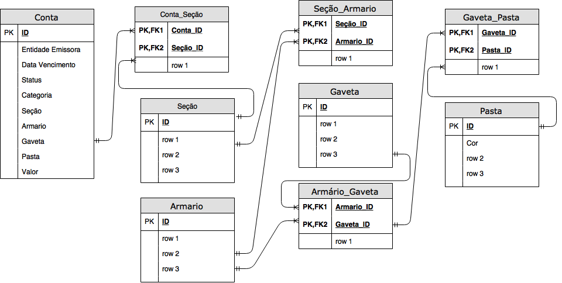

# CRUD-MegadadosP1
Projeto 1 Disciplina Megadados.

## DESCRIÇÃO:
Pessoas no dia a dia necessitam de organização com contas bancárias para saber quais contas devem pagar para não atrasar seus pagamentos e saber onde estão suas contas pagas caso necessitem de um comprovante. A organização dessas contas é uma tarefa difícil e que demanda tempo. Esta organização além de demandar tempo deve ser feita de diversas formas envolvendo a entidade responsável por essa conta, data de vencimento e seu status de paga ou não paga, além do local físico  que esta conta se encontra seja em diferentes seções,armários, gavetas e pastas de uma empresa ou domicílio. O BillOrganizer tem como objetivo, ajudar um usuário a organizar suas contas bancárias de acordo com organização/entidade emissora da conta, data de pagamento, seu valor e localização de seções, armários, gavetas e pastas além de dividi-las em pagas e não pagas para que o usuário possa se organizar e saber quais contas estão pendentes  e a localização destas para que não atrasem no pagamento.

## Diagrama de Blocos Simples

