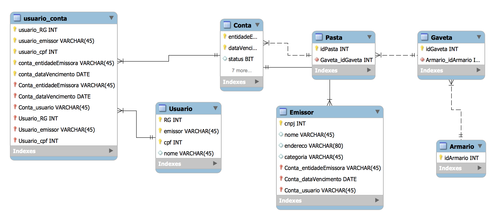

# CRUD-MegadadosP1

Projeto 1 Disciplina Megadados.

# BILLORGANIZER

## DESCRIÇÃO:
Pessoas no dia a dia necessitam de organização com contas bancárias para saber quais contas devem pagar para não atrasar seus pagamentos e saber onde estão suas contas pagas caso necessitem de um comprovante. A organização dessas contas é uma tarefa difícil e que demanda tempo. Esta organização além de demandar tempo deve ser feita de diversas formas envolvendo a entidade responsável por essa conta, data de vencimento e seu status de paga ou não paga. O BillOrganizer tem como objetivo, ajudar um usuário a organizar suas contas bancárias de acordo com organização/entidade emissora da conta, data de pagamento, seu valor e usuário pertencente  para que o usuário possa se organizar e saber a quem pertence cada conta.

## Features
O usuário do BillOrganizer poderá:

-Criar differentes usuários (para uma familia por exemplo)

-Adicionar contas de diferentes emissores.

-Atualizar e Remover contas pagas.

-Buscar suas contas, filtradas por Usúario.

## Diagrama Entidade Relacionamento

## Detalhes Técnicos: Overview da Estrutura de Solução

